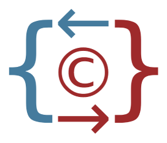

<p align="center"><a href="#" target="_blank" rel="noopener noreferrer"></a></p>

# Converter v1.1

## Introduction

Converter is a Library used to convert/map an object to another, in a simple way without doing making to many steps to achieve the object conversion.

This Mapper Lib inspired in C# AutoMapper Library.

## Usage

```java
  // Converter Instance
  IConverter converter = new Converter();

  // Entities
  Product model = new Product();

  // Mapping
  ProductDto dto = converter.map(model).to(ProductDto.class);
```

## Creating Mapping for each class type

We can also create mapping configuration for each class type, and add global options if needed.
The options can be added on **Mapping Configuration Creation** or after, it depends to you.

* Mapping Configuration Creation

```java
  // Converter Instance
  IConverter converter = new Converter();

  converter.createMap(Category.class, CategoryDto.class);

  converter.createMap(Product.class, ProductDto.class, (options) -> {
    
    options.beforeMap((src, dst) -> {
      // TODO: something nice 🤩 before the object is mapped
    });

    options.afterMap((src, dst) -> {
      // TODO: something nice 🤩 after the object is mapped
    });

  });
```

* After Mapping Configuration Creation, this way we can chain them

```java
  // Converter Instance
  IConverter converter = new Converter();

  converter.createMap(Category.class, CategoryDto.class);

  converter.createMap(Product.class, ProductDto.class)
    .beforeMap((src, dst) -> {
      // TODO: something nice 🤩 before the object is mapped
    })
    .afterMap((src, dst) -> {
      // TODO: something nice 🤩 after the object is mapped
    });
```

* If you also want to add reverse mapping for the entities, we use reverseMap to achieve that

```java
  // Converter Instance
  IConverter converter = new Converter();

  converter.createMap(Category.class, CategoryDto.class)
    .reverseMap();
```

* We can also mutate or transform a value types

```java
  // Converter Instance
  IConverter converter = new Converter();

  converter.addTransform(String.class, String[].class, (source) -> {

      String[] arrayOfStringValue = source.split(";");

      return arrayOfStringValue;
  });
```

* For self-reference objects we can limit how many objects we want to be returned using.
  By default is *3*.

```java

  // Converter Instance
  IConverter converter = new Converter();
  converter.setLimitCycleMapping(1);

```

* Using *forMember* method we can target a member and modify it value, and *skipMember* to avoid member mapping

```java
  // Converter Instance
  IConverter converter = new Converter();

  converter.createMap(User.class, UserDto.class)
    .forMember("name", (src) -> {
      return " Sr(a)." + src.getName();
    })
    .forMember(UserDto::setUsername, (src) -> {
      return "@" + src.getUsername();
    })
    .skipMember("password");
```

* Converting and modifying
```java
  // Converter Instance
  IConverter converter = new Converter();

  // Entities
  Product model = new Product();

  // Mapping
  ProductDto dto = converter.map(model).to(ProductDto.class, (options) -> {
     options.beforeMap((src, dst) -> {
      // TODO: something nice 🤩 before the object is mapped
    });

    options.afterMap((src, dst) -> {
      // TODO: something nice 🤩 after the object is mapped
    });
  });
```

* Mapping or Extracting values from another object
```java
  // Converter Instance
  IConverter converter = new Converter();

  // Entities
  Product dbModel = new Product();
  dbModel.setName("Coca Cola");
  dbModel.setPrice(0.5f);

  // Mapping
  ProductDto dtoModel = new ProductDto();
  dtoModel.setName("Sprite");
  dtoModel.setPrice(1f);

  Product dbModelMapped = converter.map(dbModel).from(dtoModel);

  // Has the same memory address
  Boolean isEquals = dbModel == dbModelMapped;  
```

* Members can be skipped while extracting values from another object using mapping actions
```java
  // Converter Instance
  IConverter converter = new Converter();

  // Entities
  Product dbModel = new Product();
  dbModel.setName("Coca Cola");
  dbModel.setPrice(0.5f);

  // Mapping
  ProductDto dtoModel = new ProductDto();
  dtoModel.setName("Sprite");
  dtoModel.setPrice(1f);

  Product dbModelMapped = converter.map(dbModel).from(dtoModel, (options) -> {
    options.skipMembers("price");

    // Note: We advice to use this one
    // The other one target every property having the same name even in their child
    // options.skipMembers(Product.class.getDeclaredField("price"));
  });
```

* Converting and modifying a list
```java
  // Converter Instance
  IConverter converter = new Converter();

  // Entities
  Product model1 = new Product();
  Product model2 = new Product();

  List<Product> models = Arrays.asList(model1, model2);

  // Mapping
  List<ProductDto> dto = converter.map(models).to(ProductDto.class, (options) -> {
    options.beforeMap((src, dst) -> {
      // TODO: something nice 🤩 before the object is mapped
      // src -> List<Product>
      // dst -> List<ProductDto> <null>
    });

    options.afterMap((src, dst) -> {
      // TODO: something nice 🤩 after the object is mapped
      // src -> List<Product>
      // dst -> List<ProductDto>
    });
    
    options.beforeEachMap((src, dst) -> {
      // TODO: something nice 🤩 before the object is mapped
      // src -> item: Product
      // dst -> item: ProductDto <null>
    });

    options.afterEachMap((src, dst) -> {
      // TODO: something nice 🤩 after the object is mapped
      // src -> item: Product
      // dst -> item: ProductDto
    });
  });
```

### Using Spring Boot

If you use SpringBoot and want to use Dependency Injection, you can create a converter config file and assign it as *@Component*:

```java
  @Component
  public class ConverterConfig extends Converter {
    public ConverterConfig() {
      
      setLimitCycleMapping(1);
      createMap(Product.class, ProductDto.class);

    }

    @Bean @Primary
    public Converter autowire() throws InstantiationException, IllegalAccessException {
      // This method is used to give the possibility to 
      // instantiate the class using @Autowired annotation
      return this; 
    }
  }
```

* Injecting in the controller via DI

```java
  @Component
  public class ProductController {
    @Autowired
    IConverter converter;
    
    @Autowired
    ProductService service;

    @GetMapping(produces = "application/json", value = "/{id}")
    public ProductDto getOne(@PathVariable("id") Long id) {
      
      Product product = service.findById(id);

      ProductDto productDto = converter.map(product).to(ProductDto.class);

      return productDto;
    }

    @GetMapping(produces = "application/json")
    public List<ProductDto> getAll() {

      List<Product> products = service.findAll();
      
      List<ProductDto> productDtos = converter.map(products).to(ProductDto.class);

      return productDtos;
    }
  }
```

## How to import into a maven project

To load the dependency to you a Maven project, you can follow these steps:

### 1. Add the following repository to your pom.xml file:

```xml
  <repositories>
    <repository>
      <id>jitpack.io</id>
      <url>https://jitpack.io</url>
    </repository>
  </repositories>
```

### 2. Add the dependency to your pom.xml file:

```xml
  <dependencies>
    ...
    
    <dependency>
      <groupId>io.github.afonsomatelias</groupId>
      <artifactId>converter</artifactId>
      <version>[tag]</version>
    </dependency>

  </dependencies>
```

  Note: Converter tags beggins with v[number]. Example: *v.1.1* 

### 3. Save the pom.xml file.

### 4. Download and Install the dependency.

```bash
  mvn clean install
```

### 5. You can now use the Converter in your Maven project.