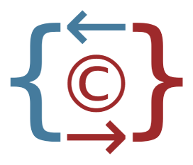

<p align="center"><a href="#" target="_blank" rel="noopener noreferrer"></a></p>

# Converter v1.6.2

## What is Converter?

Converter is a Library used to convert/map an object to another, in a simple way without doing making to many steps to achieve the object conversion.

This Mapper Lib inspired in C# AutoMapper Library... but, in this mapper you can map object right away no need to configure anything. 

In case of restricting the object conversion, you can set it to always use mapper configurations and fail if there is no configuration provided.

## Usage

```java
  // Converter Configuration Instance
  ConverterConfiguration config = new ConverterConfiguration();
  
  // Creating the Converter
  IConverter converter = config.createConverter();

  // #1 Mapping An Object

  // Entities
  Product model = new Product();

  ProductDto dto = converter.map(model).to(ProductDto.class);

  // #2 Mapping A List

  // Entities
  Product model1 = new Product();
  Product model2 = new Product();

  List<Product> models = Arrays.asList(model1, model2);

  List<ProductDto> dtos = converter.map(models).to(ProductDto.class);
```

You can use the ``beforeMap`` and ``afterMap`` methods to modify the input and/or output.

### Mapping and modifying
```java
  ConverterConfiguration config = new ConverterConfiguration();
  IConverter converter = config.createConverter();

  // Entities
  Product model = new Product();

  // Mapping
  ProductDto dto = converter.map(model).to(ProductDto.class, (options) -> {
    options.beforeMap((src, dst) -> {
      // TODO: something nice 🤩 before the object is mapped
      // src -> item: Product
      // dst -> item: ProductDto <null>
    });

    options.afterMap((src, dst) -> {
      // TODO: something nice 🤩 after the object is mapped
      // src -> item: Product
      // dst -> item: ProductDto
    });
  });
```

You can also target a specific type and modify it value on mapping process, to achieve that 
you can use the ``onMemberMap`` method.
```java
  ConverterConfiguration config = new ConverterConfiguration();
  IConverter converter = config.createConverter();

  // Entities
  Product model = new Product();

  // Mapping
  ProductDto dto = converter.map(model).to(ProductDto.class, (options) -> {
    options.onMemberMap(UserDto.class, (src, dst) -> {
      // TODO: something nice 🤩 with the object mapped
      // src -> item: Object <User>
      // dst -> item: UserDto 
    });
  });
```

It can be used also in global configuration, it shall have the same effect.
```java
  ConverterConfiguration config = new ConverterConfiguration(() -> {
    config.onMemberMap(UserDto.class, (src, dst) -> {
      // TODO: something nice 🤩 with the object mapped
      // src -> item: Object <User>
      // dst -> item: UserDto
    })
  });
  IConverter converter = config.createConverter();

  // Entities
  Product model = new Product();

  // Mapping
  ProductDto dto = converter.map(model).to(ProductDto.class);
```


In case of list objects you can use the ``beforeEachMap`` and ``afterEachMap`` methods to modify during 
the mapping process. **Note**: you may use the previous ``beforeMap`` and ``afterMap`` methods too, 
but the args will be the list of objects.

### Mapping and modifying a list
```java
  ConverterConfiguration config = new ConverterConfiguration();
  IConverter converter = config.createConverter();

  // Entities
  Product model1 = new Product("Coca Cola");
  Product model2 = new Product("Sprite");

  List<Product> models = Arrays.asList(model1, model2);

  // Mapping
  List<ProductDto> dto = converter.map(models).to(ProductDto.class, (options) -> {
    options.beforeEachMap((src, dst) -> {
      // TODO: something nice 🤩 before the object is mapped
      // src -> item: Product
      // dst -> item: ProductDto <null>
    });

    options.afterEachMap((src, dst) -> {
      // TODO: something nice 🤩 after the object is mapped
      // src -> item: Product
      // dst -> item: ProductDto
    });

    // But these still work
    options.beforeMap((src, dst) -> { /* ... */ });

    options.afterMap((src, dst) -> { /* ... */ });
  });
```

You can skip members or types that do not need to be mapped, to achieve that you can use the ``skipMembers`` and ``skipTypes`` methods.

### Mapping and skipping
```java
  ConverterConfiguration config = new ConverterConfiguration();
  IConverter converter = config.createConverter();

  // Entities
  Product model = new Product();

  // Mapping
  ProductDto dto = converter.map(model).to(ProductDto.class, (options) -> {
    
    // 1. Skip Members passing String
    options.skipMembers("name", "price");
    // 2. Skip Members passing Field (Note: Try and Catch is needed using fields)
    options.skipMembers(
      ProductDto.class.getDeclaredField("name"),
      ProductDto.class.getDeclaredField("price")
    );

    // 1. Skip Types passing String
    options.skipTypes("String", "int");
    // 2. Skip Types passing Class
    options.skipTypes(String.class, int.class);

  });
```

You can also make a copy of an object. **Note**: the returned object should have a different memory address.

### Making a copy of an Object
```java
  ConverterConfiguration config = new ConverterConfiguration();
  IConverter converter = config.createConverter();

  // Entities
  Product model = new Product();
  model.setName("Coca Cola");
  model.setPrice(0.5f);

  Product copy = converter.map(model).to();

  // Has the different memory address
  Boolean isNotEquals = model == copy;  
```
Note: We can also apply modifiers, like: ``.to((options) -> { })``

## Creating Map Configuration

We can also create mapping configuration for each class type, and add it to global configuration if needed.
Options can also be added on **Mapping Configuration**.

### Global Configuration

```java
  ConverterConfiguration config = new ConverterConfiguration((cfg) -> {
    
    cfg.createMap(Category.class, CategoryDto.class);
  
    cfg.createMap(Product.class, ProductDto.class, (options) -> {
      options.beforeMap((src, dst) -> { /* ... */ });
      options.afterMap((src, dst) -> { /* ... */ });
    });

  });
```

After the mapping configuration is created, we can also add fields modification using ``beforeMap`` 
and ``afterMap``. It can be chained.

### Mapping Configuration Creation
```java
  ConverterConfiguration config = new ConverterConfiguration((cfg) -> {
    
    cfg.createMap(Category.class, CategoryDto.class);
    
    cfg.createMap(Product.class, ProductDto.class, (options) -> { /* ... */ })
      .beforeMap((src, dst) -> { /* ... */ })
      .afterMap((src, dst) -> { /* ... */ });

  });
```

In case of mapping both ways, we can use the ``reverseMap`` method to swap the types, instead of creating 
a new mapping. **Note**: but you need to also define it own configurations.

### Reverse Mapping
```java
  ConverterConfiguration config = new ConverterConfiguration((cfg) -> {
    
    cfg.createMap(Product.class, ProductDto.class, (options) -> { /* ... */ })
      .beforeMap((src, dst) -> { /* ... */ })
      .afterMap((src, dst) -> { /* ... */ })

      .reverseMap()
      .beforeMap((src, dst) -> { /* ... */ })
      .afterMap((src, dst) -> { /* ... */ });

  });
```

We can also mutate or transform a value type... Whenever the Converter finds the mapping of the source 
type to the destination type, it will mutate the value according to the callback provided.

### Transformations
```java
  ConverterConfiguration config = new ConverterConfiguration((cfg) -> {

    cfg.addTransform(RoleString.class, RoleCollection.class, (roleString) -> {

      RoleCollection roleCollection = new RoleCollection();
      source.getValue().split(",").forEach((role) -> {
        collection.set(role);
      });

      return collection;
    });
    
  });
```

Using ``forMember`` method you can target a member and modify it value on mapping process. It can be chained.

### Using forMember
```java
  ConverterConfiguration config = new ConverterConfiguration((cfg) -> {

    cfg.createMap(User.class, UserDto.class)
      
      // # Using fieldName
      .forMember("name", (src) -> {
        return " Sr(a)." + src.getName();
      })

      // # Using setter
      .forMember(UserDto::setUserName, (src) -> {
        return "@" + src.getUserName();
      })

      // # Using member converver
      .forMember("role", (src, cvt) -> {
        
        // Adding extra mapping while mapping the member
        // Getting just one record from the list and mapping
        // From: List<Role> to: Role
        UserRoleDto role = cvt.map(src.getRoles().get(0)).to(UserRoleDto.class);

        return role;
      })

      // # Using skipMember to avoid mapping the field "password"
      .skipMember("password");
  });
```

You can also restrict the mapping by setting ``useMappingConfig`` to ``true``, this way only the mapping 
configuration will be used, otherwise it will fail on non existing configuration mapping.

### Restricting Mapping
```java
  ConverterConfiguration config = new ConverterConfiguration((cfg) -> {
    cfg.useMappingConfig(true);

    cfg.createMap(Category.class, CategoryDto.class);
    cfg.createMap(Product.class, ProductDto.class);

  });
```

By default, the Converter logs all the warnings, like the *fields that could not be instantiated*, but if 
you want to suppress it, you can use the ``setSilentLogs`` method in the configuration. We **RECOMMEND** 
setting it to ``true`` in production.

### Silent Logs
```java
  ConverterConfiguration config = new ConverterConfiguration((cfg) -> {
    cfg.setSilentLogs(true);
  });
```

## Mapping Profiles

You can separete the configuration of each class type, and add to the global configuration, to achieve this 
we can use the ``Profile`` class.

You just need to create a class that extends the ``Profile`` class, ``@Override init()``  method to create 
the configurations, and add it to the ConverterConfiguration.

### Profiles
```java
  public class UserProfile extends Profile {
    @Override
    public void init() {
      createMap(User.class, UserResponseDto.class);
      createMap(UserRequestDto.class, User.class);
    }
  }
  
  public class ProductProfile extends Profile {
    @Override
    public void init() {
      createMap(Product.class, ProductResponseDto.class);
      createMap(ProductRequestDto.class, Product.class);
    }
  }
```

And then, add the profiles to the ConverterConfiguration

### Adding Profiles
```java
  ConverterConfiguration config = new ConverterConfiguration((cfg) -> {
    cfg.addProfile(
      UserProfile.class,
      ProductProfile.class
    );
  });
```

## Extracting Values From Another Object

Converter can also extract values from another object, as long as the object has the same structure.
**Note**: the returned object should have the same memory address and only the fields with non null 
values will be extracted.

### Mapping or Extracting values from another object
```java
  ConverterConfiguration config = new ConverterConfiguration();
  IConverter converter = config.createConverter();

  // Entities
  Product dbModel = new Product();
  dbModel.setName("Coca Cola");
  dbModel.setPrice(0.5f);

  // Mapping
  ProductDto dtoModel = new ProductDto();
  dtoModel.setName("Sprite");
  dtoModel.setPrice(1f);

  Product dbModelMapped = converter.map(dbModel).from(dtoModel);

  // Has the same memory address
  Boolean isEquals = dbModel == dbModelMapped;  
```

Members can be skipped while extracting values from another object using mapping actions.

## Applying Options
```java
  ConverterConfiguration config = new ConverterConfiguration();
  IConverter converter = config.createConverter();

  // Entities
  Product dbModel = new Product();
  dbModel.setName("Coca Cola");
  dbModel.setPrice(0.5f);

  // Mapping
  ProductDto dtoModel = new ProductDto();
  dtoModel.setName("Sprite");
  dtoModel.setPrice(1f);

  Product dbModelMapped = converter.map(dbModel).from(dtoModel, (options) -> {
    options.skipMembers("price");

    // Note: We advice to use this one
    // The other one target every property having the same name even in their child
    // options.skipMembers(Product.class.getDeclaredField("price"));
  });
```

## Projecting

Converter can also project a ``HashMap`` types to a ``Model``, as long as the object has the same structure.

### Projecting HashMap
```java
  ConverterConfiguration config = new ConverterConfiguration();
  IConverter converter = config.createConverter();

  // Map
  LinkedHashMap<String, Object> user = new LinkedHashMap<String, Object>() {{
    put("name", "John Doe");
    put("username", "johndoe");
    put("password", "123.AbC");
    put("bithdate", "1989-10-15");
    put("roles", new String[]{ "ADMIN" });
  }};

  UserDto dto = converter.map(user).to(UserDto.class);
```

While projecting you can also access all the options like ``beforeMap``, ``afterMap``, etc.

### Projecting with Options
```java
  ConverterConfiguration config = new ConverterConfiguration();
  IConverter converter = config.createConverter();

  // Map
  LinkedHashMap<String, Object> user = new LinkedHashMap<String, Object>() {{
    /* ... */
  }};

  UserDto dto = converter.map(user).to(UserDto.class, (options) -> {
    options.beforeMap((src, dst) -> { /* ... */ })
    options.afterMap((src, dst) -> { /* ... */ })
  });
```

Members and Types can also be skipped while projecting the values, just like normal mapping.

### Skipping Members and Types while Projecting
```java
  ConverterConfiguration config = new ConverterConfiguration();
  IConverter converter = config.createConverter();

  // Entities
  LinkedHashMap<String, Object> user = new LinkedHashMap<String, Object>() {{
    /* ... Properties ... */
    put("password", "123.AbC");
  }};

  UserDto dto = converter.map(user).to(UserDto.class, (options) -> {
    options.skipTypes(LocalDate.class);
    options.skipMembers("password");
  });
```

In cases of types that could not be projected, you can use the method ``forMember(...)`` to intercep the 
member projection or provide a custom type resolver using the method ``use(...)`` in the ``ConverterConfiguration`` 
for global interception.

### Using forMember
```java
  ConverterConfiguration config = new ConverterConfiguration((config) -> {

    config.createMap(LinkedHashMap.class, UserDto.class)
      .forMember((src, dst) -> {
        Object value = src.getOrDefault("bithdate", null);

        if (!(value instanceof String)) return null;
        
        String str = value.toString();
        return LocalDate.parse(str.split("T")[0]);
      });
  });
  IConverter converter = config.createConverter();

  // Entities
  LinkedHashMap<String, Object> user = new LinkedHashMap<String, Object>() {{
    /* ... Properties ... */
    put("bithdate", "2025-03-25T22:44:17.605Z");
  }};

  UserDto dto = converter.map(user).to(UserDto.class);
```

### Using Type Resolvers for global interception
```java
  ConverterConfiguration config = new ConverterConfiguration((options) -> {

    options.use(LocalDate.class, (value) -> {
        if (!(value instanceof String)) return null;
        
        String str = value.toString();
        return LocalDate.parse(str.split("T")[0]);
    });
  });
  IConverter converter = config.createConverter();

  // Entities
  LinkedHashMap<String, Object> user = new LinkedHashMap<String, Object>() {{
    /* ... Properties ... */
    put("bithdate", "2025-03-25T22:44:17.605Z");
  }};

  UserDto dto = converter.map(user).to(UserDto.class, (options) -> {
    options.skipTypes(LocalDate.class);
    options.skipMembers("password");
  });
```

Or, you can create a *CustomTypeResolver* class to maintain you ConverterConfiguration nice and clean.

To achieve that, you just need to create a Class that extends ``TypeResolver``, providing the type you want to resolve 
in the *constructor* ``super(Type.class)``, implement the ``@Override resolve(...)`` method, and add it to the ConverterConfiguration.

### Using Type Resolvers (Class)
```java	
  public class LocalDateTypeResolver extends TypeResolver {
    public LocalDateTypeResolver() {
      // Setting the type to resolve
      super(LocalDate.class);
    }

    @Override
    public LocalDate resolve(Object value) {
      // Resolving the type
      
      if (!(value instanceof String))
        return null;

      String str = value.toString();
      return LocalDate.parse(str.split("T")[0]);
    } 
  }
```

```java
  ConverterConfiguration config = new ConverterConfiguration((options) -> {
    options.use(LocalDateTypeResolver.class);
  });
  IConverter converter = config.createConverter();

  // Entities
  LinkedHashMap<String, Object> user = new LinkedHashMap<String, Object>() {{
    /* ... Properties ... */
    put("bithdate", "2025-03-25T22:44:17.605Z");
  }};

  UserDto dto = converter.map(user).to(UserDto.class, (options) -> {
    options.skipTypes(LocalDate.class);
    options.skipMembers("password");
  });
```

Beside that, it can also project an ``Interface`` types to a ``Model`` or ``Model`` to an ``Interface`` as long as the object has the same structure.

### Projecting Interface (Projection)
```java
  ConverterConfiguration config = new ConverterConfiguration();
  IConverter converter = config.createConverter();

  // Map
  ProductProjection projection = new ProductProjection() {
    @Override
    public String getName() { return "Coca Cola"; }
    @Override
    public Float getPrice() { return 0.5f; }
    @Override
    public String[] getCategories() { 
      return new String[]{ "Liquid", "SoftDrink" };
    }
    @Override
    public Integer getQuantity() { return 15; }
  };

  ProductDto dto = converter.map(projection).to(ProductDto.class);
```

```java
  ConverterConfiguration config = new ConverterConfiguration();
  IConverter converter = config.createConverter();

  Product product = new Product();

  ProductProjection dto = converter.map(projection).to(ProductProjection.class);
```

Projecting a List follows the same logic...

### Projecting List of Interface (Projections)
```java
  ConverterConfiguration config = new ConverterConfiguration();
  IConverter converter = config.createConverter();

  // Map
  ProductProjection projection1 = new ProductProjection() { /* ... */ };
  ProductProjection projection2 = new ProductProjection() { /* ... */ };

  List<ProductProjection> projections = Arrays.asList(projection1, projection2);

  List<ProductDto> dtos = converter.map(projections).to(ProductDto.class);
```

```java
  ConverterConfiguration config = new ConverterConfiguration();
  IConverter converter = config.createConverter();

  Product product1 = new Product();
  Product product2 = new Product();

  List<Product> products = Arrays.asList(projection1, projection2);

  List<ProductProjection> dtos = converter.map(products).to(ProductDto.class);
```

  **Note**: Interface projections follows exactly the same logic as the ``HashMap`` projections, you can add options while mapping, 
  apply ``skips``, ``beforeMap``, ``afterMap``, and also use ``CustomTypeResolvers``.

## Using Spring Boot

If you are using SpringBoot and want to use Dependency Injection, you can create a converter config class 
extending ``ConverterConfiguration`` and assign it as ``@Component`` annotation:

```java
  @Component
  public class ConverterConfig extends ConverterConfiguration {
    public ConverterConfig() {
      
      // Only crutial logs (System.err) will be printed
      setSilentLogs(true);

      // Adding all the profiles
      addProfile(
        ProductProfile.class, 
        UserProfile.class
      );

      // Adding all the type resolvers 
      use(
        LocalDateTypeResolver.class,
        LocalDateTimeTypeResolver.class
      );
    }

    @Bean @Primary
    public Converter autowire() throws InstantiationException, IllegalAccessException {
      // This method is used to give the possibility to 
      // instantiate the class using @Autowired annotation
      return this.createConverter(); 
    }
  }
```

* Injecting in the controller via DI

```java
  @Component
  public class ProductController {
    @Autowired
    IConverter converter;
    
    @Autowired
    ProductService service;

    @GetMapping(produces = "application/json", value = "/{id}")
    public ProductDto getOne(@PathVariable("id") Long id) {
      
      Product product = service.findById(id);

      ProductDto productDto = converter.map(product).to(ProductDto.class);

      return productDto;
    }

    @GetMapping(produces = "application/json")
    public List<ProductDto> getAll() {

      List<Product> products = service.findAll();
      
      List<ProductDto> productDtos = converter.map(products).to(ProductDto.class);

      return productDtos;
    }
  }
```

## How to import into a maven project

To load the dependency to you a Maven project, you can follow these steps:

### 1. Add the following repository to your pom.xml file:

```xml
  <repositories>
    <repository>
      <id>jitpack.io</id>
      <url>https://jitpack.io</url>
    </repository>
  </repositories>
```

### 2. Add the dependency to your pom.xml file:

```xml
  <dependencies>
    <dependency>
      <groupId>io.github.afonsomatelias</groupId>
      <artifactId>converter</artifactId>
      <version>[tag]</version>
    </dependency>
  </dependencies>
```

  Note: Converter tags begins with v[number]. Example: *v.1.5.0* 

### 3. Save the pom.xml file.

### 4. Download and Install the dependency.

```bash
  mvn clean install
```

<p >
  <h2 align="center">You can now use the Converter in your Maven project.</h2>
  <h1 align="center"> Congrats 🥳🎉 </h1>
</p>